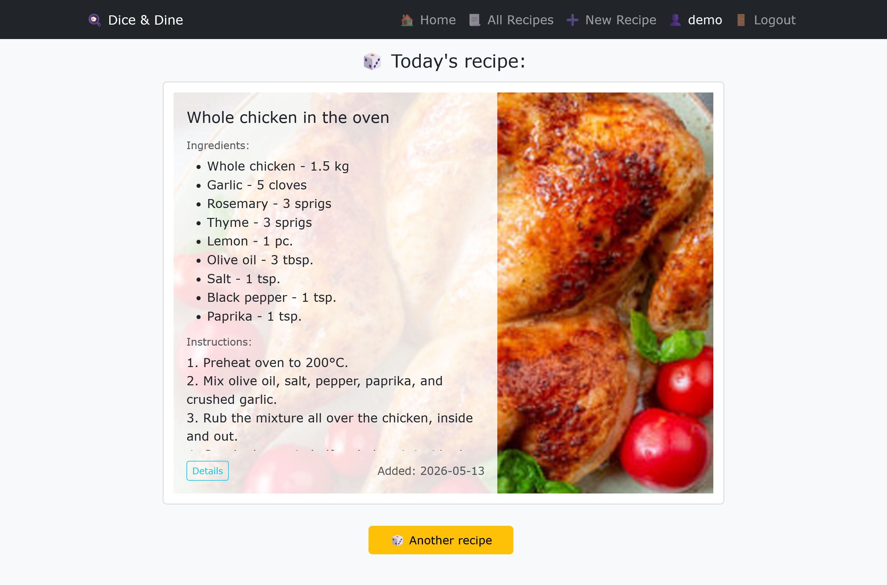
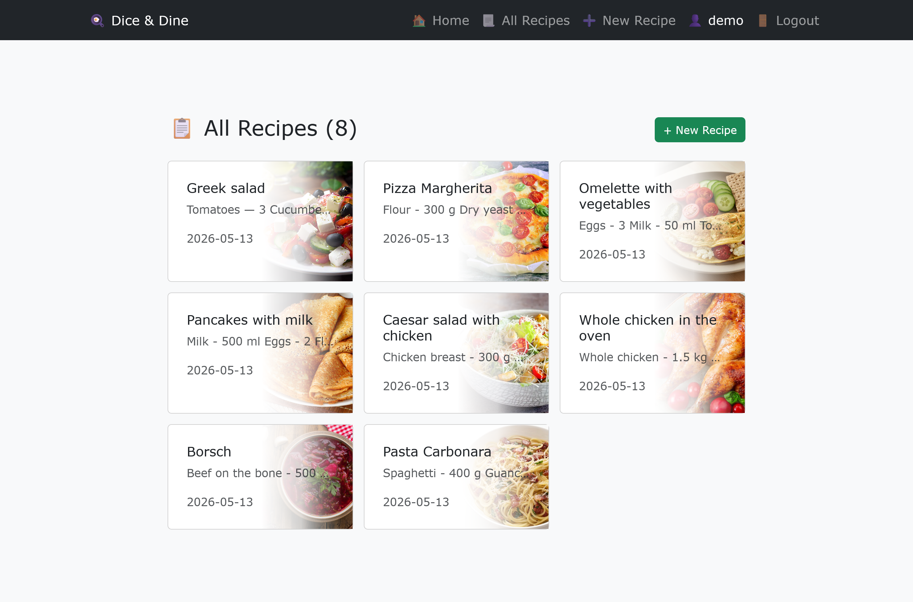
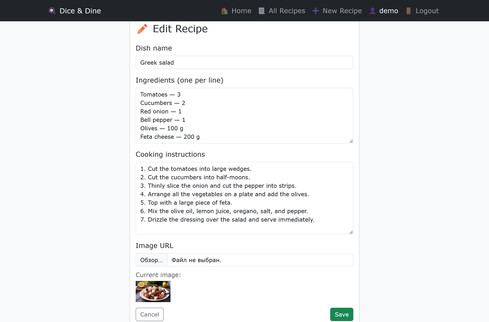

# 🍳 Dice & Dine

A personal recipe manager that takes the cognitive load out of deciding what to cook for dinner every day.

## Demo





## Product Context

### End Users

One or more people / a family who:
- Cook at home several times a week
- Are tired of deciding what to cook every day
- Have a set of 10–20 go-to dishes they all know and can cook
- Want a simple way to store their recipes and get random suggestions

### Problem

Every day you spend time mentally browsing through the same 3–4 dishes. The cognitive load of choosing "what's for dinner" gets boring and exhausting, yet you know you can cook 10–30 different meals.

### Solution

A web application that stores your personal recipe collection and offers one random recipe on the main page every time you visit. If you're not in the mood for today's suggestion, click "Another recipe" and get a different random pick. No more decision fatigue.

## Features

### Implemented
- ✅ **User registration and login** — simple auth with username + password (bcrypt hashing, session cookies)
- ✅ **Recipe CRUD** — create, view, edit, and delete recipes via a web form
- ✅ **Random recipe on home page** — each visit shows a random recipe from your collection
- ✅ **"Another recipe" button** — loads a different random recipe without page reload (JS `fetch` + smooth scroll)
- ✅ **Recipe list** — all your recipes in a compact card grid, clickable to open details
- ✅ **Recipe detail page** — full card with ingredients, instructions, and image
- ✅ **Image upload** — upload your own images for recipes (stored in `/uploads/`)
- ✅ **i18n-ready text layer** — all user-facing strings in `texts.json`, editable without server restart
- ✅ **Responsive design** — works on mobile (cards stack vertically on small screens)

### Not Yet Implemented
- ❌ **"Cooking today" button** — mark a recipe as cooked today for statistics
- ❌ **Cooking statistics** — see how often you cook each recipe
- ❌ **Shopping list** — aggregate ingredients from selected recipes
- ❌ **Multiple users sharing a collection** — family sharing feature
- ❌ **Dark mode**
- ❌ **Recipe categories / tags**

## Usage

1. **Register** a new account to create new recipe book
2. On the **home page** you'll see a random recipe from your collection
3. Click **"Another recipe"** to get a different random suggestion
4. Go to **"All Recipes"** to see your whole collection in a grid
5. Click **"+ New Recipe"** to add a new dish (fill in name, ingredients, instructions, optionally upload an image)
6. Click on a recipe card to view full details, edit, or delete it

## Deployment

### OS

The VM should run **Ubuntu 24.04 LTS** (or any modern Linux distribution).

### Required Software

- Python 3.11+
- pip (Python package manager)
- Git

### Step-by-step Deployment Instructions

```bash
# 1. Clone the repository
git clone https://github.com/AJediYouAre/se-toolkit-hackathon.git
cd se-toolkit-hackathon

# 2. Create a virtual environment and activate it
python3 -m venv venv
source venv/bin/activate

# 3. Install dependencies
pip install -r app/requirements.txt

# 4. Seed the database with demo data
cd app
python seed.py

# 5. Run the server
uvicorn main:app --host 0.0.0.0 --port 8000
```

The application will be available at **http://your-vm-ip:8000**

Demo credentials: `demo` / `demo123`

### Using as a systemd service (optional)

Create `/etc/systemd/system/recipe-rotator.service`:

```ini
[Unit]
Description=Recipe Rotator
After=network.target

[Service]
User=your-user
WorkingDirectory=/home/your-user/se-toolkit-hackathon/app
ExecStart=/home/your-user/se-toolkit-hackathon/venv/bin/uvicorn main:app --host 0.0.0.0 --port 8000
Restart=always

[Install]
WantedBy=multi-user.target
```

```bash
sudo systemctl enable --now recipe-rotator